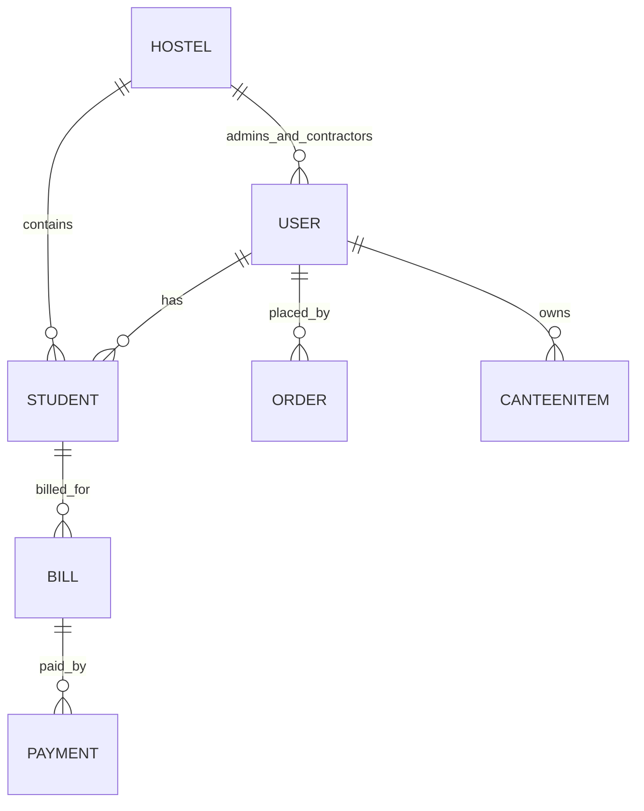

# MESS Project — Architecture & Role Audit

This document is a consolidated, deep-dive audit of the project located at the workspace root. It describes the overall architecture, data models, roles and their responsibilities, API surface and where each role can act, service interactions, middleware/enforcement, real-time patterns, and the frontend integration points. Use this as a single reference file for understanding how pieces connect.

---

## 1. High-level Architecture

- Backend: Node.js + Express-style controllers, MongoDB (Mongoose) models, modular `controllers`, `services`, `models`, `routes`, `middlewares`.
- Frontend: React (Vite), `AuthContext` for session, role-protected routes via `ProtectedRoute` and `AppRoutes.jsx`.
- Real-time: Socket.IO (backend exposes `io` on `req.app.get('io')`) for live updates (orders, menus, complaints, requests).
- Storage: MongoDB collections represented by Mongoose models (User, Student, Bill, Payment, Order, CanteenItem, Hostel, Notification, Complaint, FineRule, AuditLog, etc.).

Mermaid component relationship (simplified):

```mermaid
graph LR
  Browser[Client (React App)] -->|REST / Websocket| API[Node/Express API]
  API --> DB[(MongoDB)]
  API --> Services[Domain Services]
  Services --> DB
  Controllers --> Services
  Controllers --> Middlewares
  Browser -->|Socket.IO| API
```

---

## 2. Roles & Functionalities

Roles enumerated in code (see server/constants/roles.js): student, contractor, admin, superadmin, staff.

For each role: responsibilities and typical API actions.

- Student
  - Capabilities:
    - Register / Login; view own profile (`/auth/me`).
    - Toggle diet off (`/diet/toggle`), view diet history and today’s diet status.
    - Place canteen orders (`POST /orders`), view own orders and payment history.
    - View current bill (`/billing/live`), view bill history, pay (via frontend -> payment flow recorded by `Payment` model).
    - File complaints/requests.
  - Data access: owns `User` and `Student` records; limited to their `Student` and `Bill` documents.

- Contractor
  - Capabilities:
    - Manage canteen items: add/edit/delete (`/canteen/items`).
    - Set daily availability and stock before cutoff (`/canteen/availability`).
    - Approve/reject pending student orders (`/orders/:id/approve`, `/orders/:id/reject`).
    - Manage diet plans for their assigned hostel, view complaints for their hostel, create contractor requests.
  - Data access: operates on `CanteenItem`, `Order` (their contractorId), and `Hostel` entries where they are assigned.

- Admin
  - Capabilities:
    - Manage students, staff, contractors for their hostel (`/admin/*` endpoints).
    - Configure hostel-level settings: diet rules, payment due days, payment methods.
    - Generate monthly bills, trigger reminders, view diet metrics and reports, resolve contractor requests and complaints.
    - Send bulk notifications to students in hostel.
  - Data access: full control over hostel-scoped resources (Students, Bills, Hostel config, Complaints).

- Superadmin
  - Capabilities:
    - Platform-level management: create/deactivate admins, view audit logs, publish announcements across hostels, system stats.
  - Data access: global — AuditLog, all Hostels, Users, Bills.

- Staff
  - Role exists in `User.role` enum and treated like admin-like resource for staff management; permissions vary in controllers (primarily managed by Admins).

Role enforcement: `server/middlewares/roleGuard.js` exposes helpers: `isStudent`, `isContractor`, `isAdmin`, `isSuperAdmin`, `isAdminOrAbove`, etc. Authentication is performed by `server/middlewares/auth.js` which verifies JWT and attaches `req.user` (and `req.user.profile` loaded from DB in middleware).

---

## 3. Key Data Models & Relationships

- `User` (polymorphic base for students, contractors, admins, superadmin)
  - Fields: `name, email, password, role, hostelId, isActive`.

- `Student`
  - Linked to `User` by `userId`.
  - Student-specific: `rollNumber, roomNumber, dietStatus, dietOffHistory, hostelId`.

- `Bill`
  - Linked to `Student` via `studentId`.
  - Billing fields: `dietCharges, canteenCharges, fineAccrued, totalAmount, status, dueDate, paidAt`.

- `Payment`
  - Linked to `Bill` and `Student`.

- `Order`
  - `studentId`, `contractorId`, `items[] (itemId, quantity, price)`, `status` (`pending/approved/rejected`).

- `CanteenItem`
  - Owned by `contractorId`; fields: `name, price, dailyStock, isAvailable`.

- `Hostel`
  - Hostels map students + contractor + admin; contains `dietCutoffTime, dietPricePerDay, paymentDueDays, dietPlan, paymentMethod`.

- `Notification`, `Complaint`, `FineRule`, `AuditLog` — auxiliary models used for messaging, issue tracking, fine policies, and auditing.

Entity diagram (simplified):



---

## 4. API Surface & Controller Mapping (summary)

Major controller files (server/controllers):

- `authController.js`: register, login, getMe, changePassword.
- `adminController.js`: student/staff/contractor management, set diet rules, payment methods, reports, notifications, contractor requests resolution.
- `billingController.js`: get live bill, bill history, bill by id, generate monthly bills, update fines, list hostel bills.
- `orderController.js`: place order (student), approve/reject order (contractor), contractor-created orders, queries for orders (student/contractor/admin).
- `canteenController.js`: add/edit/delete canteen items (contractor), set daily availability, diet plan, complaints for contractor, contractor requests.
- `dietController.js`: get diet status, toggle diet off, admin update rules, diet plan retrieval.
- `notificationController.js`: get notifications, mark read, mark all read.
- `fineController.js`: get/set fine rules, fine breakdown.
- `superAdminController.js`: create/deactivate admins, get audit logs, publish announcements, system stats.

Routes are wired to controllers and protected by `auth` middleware and `roleGuard` checks in route files (server/routes/*). The pattern: verifyToken -> roleGuard where applicable -> controller.

---

## 5. Middlewares & Security

- `auth.js` (verifyToken): validates JWT, loads `User` (without password) into `req.user.profile`, sets `req.user` fields.
- `roleGuard.js`: maps role names to numeric levels and provides exact/min-level checks.
- `validation.js`: input/time validations used by controllers.
- `asyncHandler`: wraps async controllers and centralizes error handling.

JWT settings: `process.env.JWT_SECRET` (fallback `change_this_secret`) used by `generateToken` utility.

Notes / recommendations:
- Token verification fetches full user profile on every request — good for always-fresh role/hostel checks but adds DB load; consider caching or embedding minimal info in token if scale requires.
- Ensure `JWT_SECRET` is strong in production and token expiry is enforced and refreshed appropriately.

---

## 6. Services & Business Logic

Services centralize domain logic; notable ones:

- `billingService`:
  - `getLiveBill(studentUserId)` → aggregates diet calculations and approved canteen charges, plus accrued fines.
  - `generateMonthlyBill(studentUserId, month, year)` → persists `Bill` and sets `dueDate` using `Hostel.paymentDueDays`.
  - `updateFinesForOverdueBills()` → applies `FineRule` slabs via `utils/fineCalculator`.

- `orderService`:
  - Normalizes items, validates availability/stock, creates `Order` (pending for student-created, approved when contractor-created), handles approve/reject flows and stock deductions.

- `notificationService`:
  - Central persistence for `Notification` model, bulk notifications, payment reminders, unread counts.

- `dietService`:
  - Tracks `DietLog` entries, toggles diet on/off, calculates active days.

Audit logging: `auditService.logAction()` is used across controllers to create `AuditLog` entries for important actions (login, create admin, generate bills, etc.). Superadmin can view audit logs.

---

## 7. Real-time & Events

- Socket usage:
  - Controllers obtain `io` from `req.app.get('io')` and emit events for order updates, menu/availability changes, complaint updates, and contractor request updates.
  - Example events: `order:update`, `menu:update`, `complaint:update`, `request:update`.

- Typical flow: a contractor sets availability -> controller emits `menu:update` to `hostel:<hostelId>` room; students in that hostel should be subscribed to that room on client socket.

---

## 8. Frontend Integration

- Auth flow:
  - `AuthProvider` reads `token` from `localStorage`, calls `GET /auth/me` via `http` helper (`my-project/src/api/http.js`).
  - `login()` stores the token and refetches user.

- Route protection:
  - `ProtectedRoute` enforces `allowedRoles` by checking `user.role` from `AuthContext`.
  - `AppRoutes.jsx` organizes role-specific routes under `/student/*`, `/contractor/*`, `/admin/*`, `/superadmin/*`.

- Frontend hooks/usage:
  - `useAuth()` provides `user`, `login`, `logout`, `refreshUser`.
  - Various `use*` hooks (e.g., `useBilling`, `useOrder`, `useDiet`) wrap API calls and map to UI pages.

---

## 9. Typical Sequence Flows

1) Student Login

```sequence
Student->Server: POST /auth/login (email,password)
Server->DB: Validate credentials (User.findOne)
Server->Student: 200 + token
Student->Server: GET /auth/me (with Bearer token)
Server->DB: Load user profile
Server->Student: user profile
```

2) Place Canteen Order (student)

```sequence
Student->Server: POST /orders { items, contractorId }
Server->OrderService: validate items (CanteenItem) & compute total
OrderService->DB: create Order (status: pending)
Server->NotificationService: sendNotification(contractorId,...)
Server->Student: 201 + order
Socket: io.emit('order:update') to contractor room
```

3) Contractor Approves Order

```sequence
Contractor->Server: POST /orders/:id/approve
Server->OrderService: check stock, deduct dailyStock, set status=approved
OrderService->DB: update Order
Server->NotificationService: notify student
Socket: io.emit('order:update') broadcast
```

4) Admin Generates Monthly Bills

```sequence
Admin->Server: POST /billing/generate {hostelId, month, year}
Server->BillingService: for each student, calculate diet + canteen charges, generate Bill, set dueDate
BillingService->DB: insert Bill documents
Server->AuditService: log generation
Server->Admin: 200 + results
```

---

## 10. Role-Endpoint Matrix (concise)

- Student: auth, diet toggle, place orders, view bills, payments, notifications, complaints.
- Contractor: manage items, set availability, approve/reject orders, manage diet plan, view hostel complaints.
- Admin: manage students/staff/contractors, billing generation, reports, notifications, set hostel rules.
- Superadmin: manage admins, audit logs, platform-wide announcements, system stats.

---

## 11. Observations & Recommendations

- Authentication:
  - verifyToken hits DB every request to fetch profile; this is safe but consider token payload containing role+id and optionally short TTL refresh if DB load becomes an issue.
- Authorization:
  - roleGuard provides numeric levels; controller-level checks sometimes re-validate e.g. contractor-hostel ownership — good practice.
- Audit & Monitoring:
  - Audit logging is present for key actions — ensure logs are rotated/stored securely and scrub sensitive data.
- Real-time:
  - Socket channels are used but ensure clients join the correct rooms (e.g., `hostel:<id>`) and socket authentication is enforced.
- Payments:
  - Payment flow persists `Payment` model with `status`; ensure reconciliation with payment gateways and idempotency handling.

---

## 12. Where to look in code

- Role definitions: [server/constants/roles.js](server/constants/roles.js)
- Auth middleware: [server/middlewares/auth.js](server/middlewares/auth.js)
- Role guard: [server/middlewares/roleGuard.js](server/middlewares/roleGuard.js)
- Controllers: [server/controllers](server/controllers)
- Services: [server/services](server/services)
- Frontend auth & routes: [my-project/src/context/AuthContext.jsx](my-project/src/context/AuthContext.jsx), [my-project/src/components/ProtectedRoute.jsx](my-project/src/components/ProtectedRoute.jsx), [my-project/src/routes/AppRoutes.jsx](my-project/src/routes/AppRoutes.jsx)

---

If you'd like, I can:

- Generate a more detailed per-endpoint list (HTTP method, path, required params, auth/roles) into the same file.
- Produce a visual sequence diagram per flow as standalone images.
- Create a separate security checklist with exact fixes/priorities.

Tell me which of the above you want next and I will extend this file accordingly.
